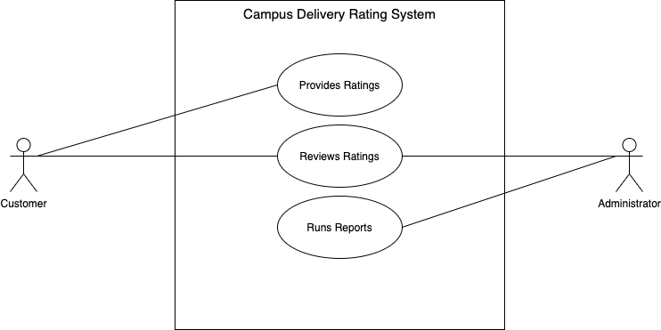
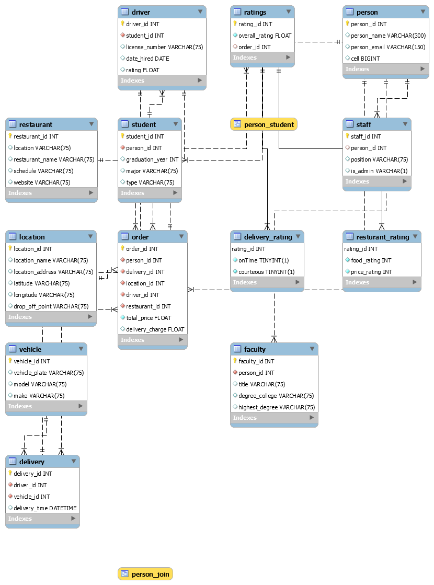

# Campus Delivery Service

## Introduction
A controlled campus delivery service is offered on university campuses which allows students to order food and earn money as delivery drivers. We are implementing a rating system that tracks ratings for delivery drivers and restaurants. The rating system stores information about individual drivers and restaurants along with their ratings.

## Use Case For Rating System

## Business Rules
* Customers may choose to not provide a rating 
* Customers must be a faculty, student, or staff
* One customer can only be a faculty, student, or staff
* Only students can be drivers and must be approved
* Database will store the drivers license number, datehired, vehicle information, and ratings
* All deliveries are tied to one person/customer and one restaurant
* Restaurants may have many drivers
* Drivers may deliver for one restaurant and one order at a time
* One person may order one or many times and therefore can rate many times
* Restaurants must be approved and will provide an ID, location, schedule, website, and other attributes
* Administrators must be approved and can choose to not review any ratings
* Ratings will include a description and 1-5 star rating

## EERD

## MySQL Queries

## Stored Procedures
## Web/App Implementation (Optional) or Description of Future Work
## MySQL Dump
[SQL Dump](ITCS 3160 Group 2 project.sql)
## Project Video

## Contributors
* Wallid Ortiz
* Christian Hasty
* Hunter Hawkins
* Connor Kells
